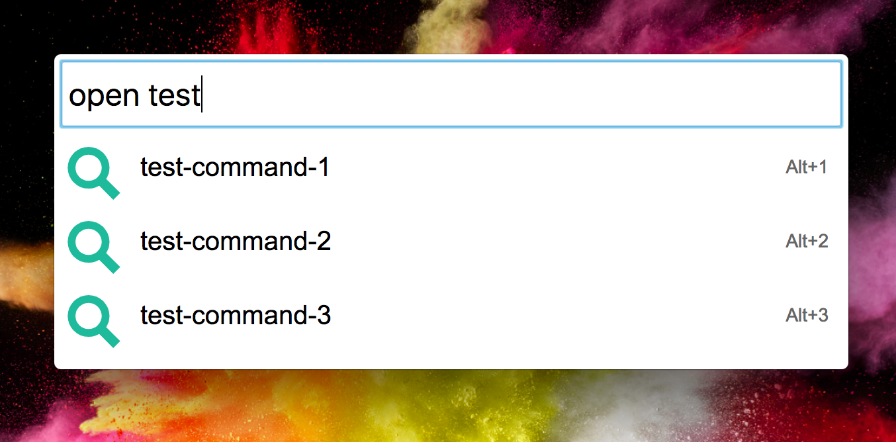
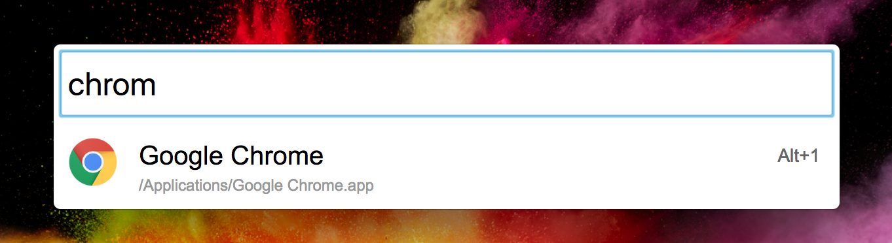
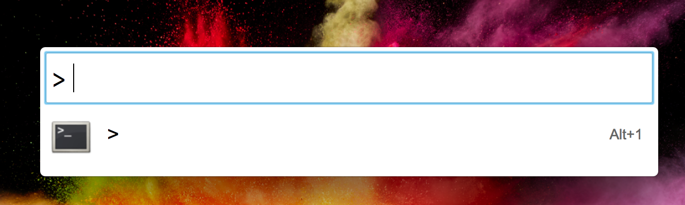
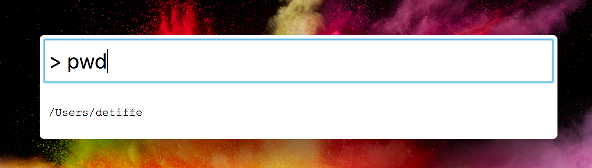

# Bert

## Intro

Bert is a cross platform launcher based on [Electron](https://github.com/electron/electron) and inspired by [Enso Launcher by Humanized](https://www.reddit.com/r/answers/comments/2dw0n2/what_happened_to_humanized_especially_their/).

It's initially a fork from [ELaunch](https://github.com/zaaack/ELaunch).

I rely on Bert daily on MAC OS for work. I have thousands of shortcuts saved.
Never tried it on Windows or Linux.

### Features

Bert essentially adds [a new plugin](https://github.com/andrewde/Bert/blob/master/app/plugins/enso/index.js) to simulate Enso Launcher.

We support the plugins initially included in [ELaunch](https://github.com/zaaack/ELaunch):

- Search an app on the system (*app*).
- find a file (*find*).
- Web search (*websearch*).
- Shell prompt (*shell*).
- Calculator (*calc*).

App plugin:

Shell plugin:

## FAQ

### Download

Find a zip of the app file for `Mac OS` [here](https://github.com/andrewde/Bert/releases/tag/v1.0).

For Windows and Linux, you have to build it yourself.
See our [developer guide](Development.md).

### How to open Bert launcher

Default Shotcut:

`Command+Space` for linux and windows, `Cmd+E` for MacOS

### How to save a new command/shortcut

Open Bert.
Type: `learn <name> as <url>`
Example: `learn google as https://google.com`

### How to open a command previously saved

Open Bert.
Type: `open <name>`
Example: `open google`

### How to update or delete a command

This can be done by changing the underlying `.url` file linked to a command.

Coommands are saved as `.url` files under `~/.bert/Enso`.
'.url' is presumably a cross platform format for URLs.

Just rename the file name (which is actually the command name).

### Where does Bert saves my user settings, shortcuts etc

Everything is saved in a hidden directory under the current user home directory (`os.homedir()`) at `~/.bert`.

### Where are my commands/shortcuts saved

Coommands are saved as `.url` files under `~/.bert/Enso`.
'.url' is presumably a cross platform format for URLs.

### How to change my settings

There is a settings json file that you can customize.
The file is localted in Bert's data directory `~/.bert/config.json5`.
It's auto-generated the first time you launch Bert.

## Roadmap

Our priorities are as follow:

- Fuzzy search. Currently, we have a naive string matching ([see code](https://github.com/andrewde/Bert/blob/master/app/plugins/enso/index.js#L20)).
- Add capability to save system path and not just web urls. The idea here is to invoke scripts on-demand.
